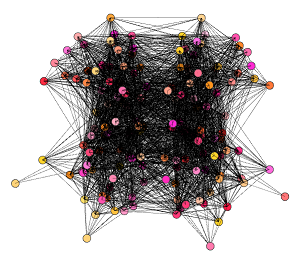

# NetRender
> Script to render interactive brain networks in three-dimensional space

I wrote this script in Spring 2018 while taking [CS 4984: Computing The Brain](http://courses.cs.vt.edu/cs4984/2018-spring-computing-the-brain/) Capstone, taught by [T.M. Murali](http://bioinformatics.cs.vt.edu/~murali/), at Virginia Tech.