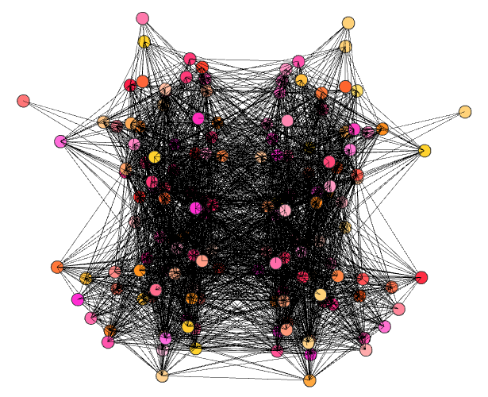

# NetRender
> A script to render interactive brain networks in three-dimensional space

I wrote this script in Spring 2018 while taking [CS 4984: Computing The Brain](http://courses.cs.vt.edu/cs4984/2018-spring-computing-the-brain/) Capstone, taught by [T.M. Murali](http://bioinformatics.cs.vt.edu/~murali/), at Virginia Tech. Many of the assignments involved analysis of large-scale brain networks, which proved to be difficult without a visual point of reference. Dr. Murali mentioned that the visualization of a network in the shape of the brain would make a great addition to my semester project, but all of the open-source tools I tried (such as [cvu](https://github.com/aestrivex/cvu) and [flexbgv](https://sourceforge.net/projects/flexbgv/)) required huge dependencies and custom file formats without much documentation.
This project allows users to render interactive 3D networks in their browser using Python without excessive dependencies. My goal is that future CS 4984 can use this program to help understand their assignments and make cool images for presentations.

## Table of Contents
  * [Installation](#installation)
    - [Dependencies](#dependencies)
  * [Usage](#usage)
    - [Input Format](#input-format)
    - [Command-Line Options](#command-line-options)
    - [Saving Networks](#saving-networks)

## Installation

### Dependencies

## Usage

### Input Format
The input for the program is a standard edge list file following the usual format 'src_node  dst_node  weight' on each line of the file. The program can accept as input a .txt file, with either tab-delimited or space-delimited values, or a .csv file following the aforementioned format.

One important thing to note is that the program does not currently account for column headers in input files. Shown below are examples of incorrect and correct input files with headers and without headers, respectively:

Incorrect:

Correct:

### Command-Line Options

### Saving Networks
