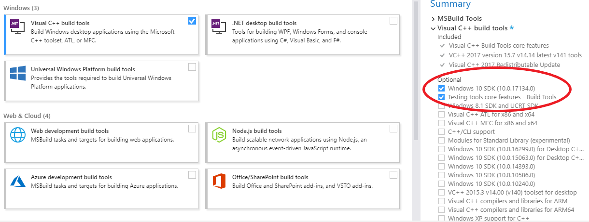
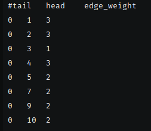
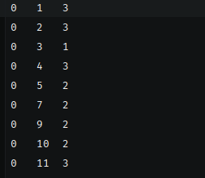
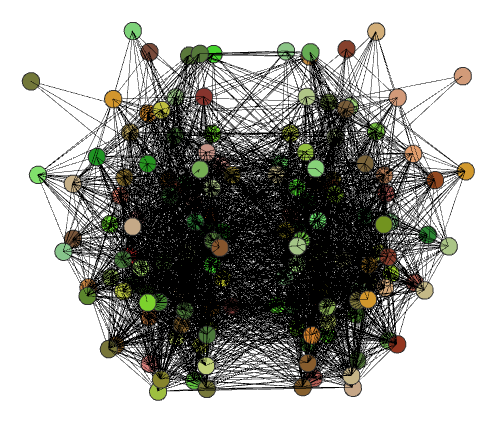
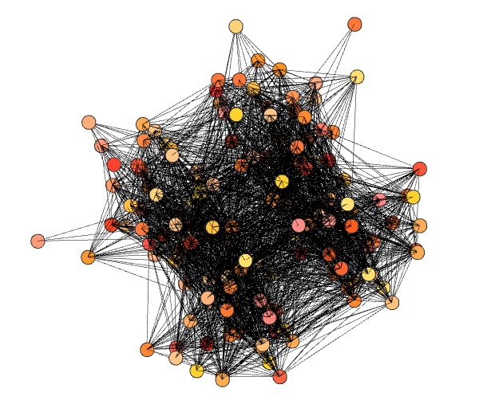
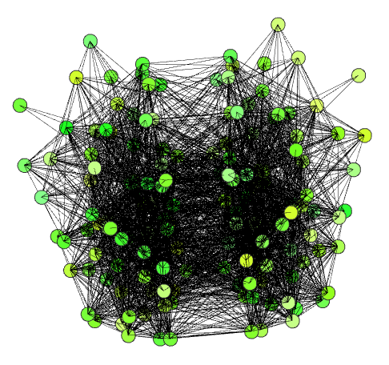
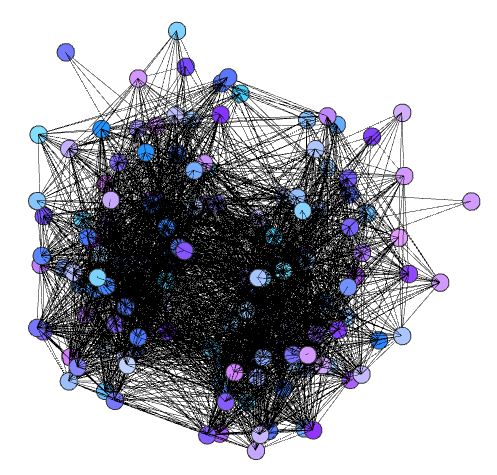
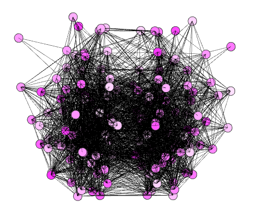
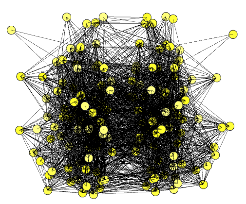

# NetRender
> Script to render interactive brain networks in three-dimensional space

I wrote this script in Spring 2018 while taking [CS 4984: Computing The Brain](http://courses.cs.vt.edu/cs4984/2018-spring-computing-the-brain/) Capstone, taught by [T.M. Murali](http://bioinformatics.cs.vt.edu/~murali/), at Virginia Tech. 
Many of the assignments involved analysis of large-scale brain networks, which proved to be difficult without a visual point of reference. 
Dr. Murali mentioned that the visualization of a network in the shape of the brain would make a great addition to my semester project, but all of the open-source tools I tried (such as [cvu](https://github.com/aestrivex/cvu) and [flexbgv](https://sourceforge.net/projects/flexbgv/)) were outdated, and required large dependencies or custom file formats without sufficient documentation.
At times it felt like I had to put more work into configuring visualizations than actually focusing on important neuroscience concepts and graph algorithms.
This project allows users to render interactive 3D networks in their browser using Python without the need for excessive dependencies. 
My goal is that future CS 4984 can use this program to help understand their assignments and make cool images for presentations.

<br> <!-- ############################################################################################################################################################################################################################################################################################### -->

## Table of Contents
  * [Installation](#installation)
    - [Plot.ly](#plot.ly)
    - [Python-igraph](#python-igraph)
      - [Linux](#linux)
      - [Windows](#windows)
  * [Usage](#usage)
    - [Input Format](#input-format)
    - [Command-Line Options](#command-line-options)
    - [Examples](#examples)
    - [Output](#output)
  * [Implementation](#implementation)

<br> <!-- ############################################################################################################################################################################################################################################################################################### -->

## Installation
To install, simply clone this repository using the following command: 
```commandline
git clone https://github.com/tsevans/NetRender.git
```

If you do not already have Python on your computer, you'll want to download that [here](https://www.python.org/downloads/). 
Make sure to use Python **2.7** - I'm currently using version 2.7.15. 
There was a compatibility issue with plot.ly and Python 3.6.5, so you'll want to make sure you're using the correct version of Python.

### *Plot.ly*

The first dependency needed to run this script is [Plot.ly](https://plot.ly/), a free and open-source visualization library packaged into a Python module.
This script generates temporary visualizations in your local environment, but with a few modifications you can save ~25 visualizations by signing up for a [free Plot.ly account](https://plot.ly/accounts/login/#/).

Install the plot.ly module with the following command:
```commandline
pip install plotly
```

### *Python-igraph*

The second dependency needed to run this script is [python-igraph](http://igraph.org/python/), a free and open-source collection of network analysis tools implemented as a C library with Python extensions.
As with many other Python packages it may be tempting to use `pip install`; however, this method did not prove to be effective on any of the systems I tried.
Luckily for you, I've already been down the rabbit hole of Stack Overflow posts on the issue and found solutions to install python-igraph on both Linux and Windows.

#### *Linux*

If you're running Linux the installation is simple, just run the following commands:
```commandline
sudo apt-get update
sudo apt-get install python-igraph
```
This worked when tested on both KDE and Ubuntu using the apt package manager.
If you use another package manager or run any special configurations, the commands may need to be modified accordingly.

#### *Windows*

If you're running Windows there will be some additional steps in order to support the C language requirements.

* Download and install the [Microsoft Visual C++ Build Tools](https://www.visualstudio.com/downloads/#build-tools-for-visual-studio-2017)
    
    * You should only need to check these two options on the installer 
      

* Download the [wheel archive for Pycairo](https://www.lfd.uci.edu/~gohlke/pythonlibs/#pycairo)
    
    * After downloading, install the package. The command I used was:
        ```commandline
        pip install pycairo-1.16.3-cp27-cp27m-win_amd64.whl 
        ```

* Download the [wheel archive for Python-igraph](https://www.lfd.uci.edu/~gohlke/pythonlibs/#python-igraph)
    
    * After downloading, install the package. The command I used was:
        ```commandline
        pip install python_igraph-0.7.1.post6-cp27-cp27m-win_amd64.whl 
        ```
        
When installing wheel archives you might see an error like this:
```diff
- pycairo-1.16.3-cp27-cp27m-win32.whl is not a supported wheel on this platform.
```
In this case you will need to download the correct wheel corresponding to your version of Python.

<br> <!-- ############################################################################################################################################################################################################################################################################################### -->

## Usage

This program takes a single file as input and can be run using the command:
```commandline
python netrender.py <input.txt>
```
where `<input.txt>` is the name or relative path to the file you wish to visualize.

### *Input Format*
The input for the program is a standard edge list file following the usual format [`src_node` `dst_node` `weight`] on each line of the file. The program can accept as input a .txt file, with either tab-delimited or space-delimited values, or a .csv file following the aforementioned format.

One important thing to note is that the program does not currently account for column headers in input files. Shown below are examples of incorrect and correct input files with headers and without headers, respectively:

*Incorrect:*                                                    |  *Correct:*
:--------------------------------------------------------------:|:--------------------------------------------------------------:
  |  

If your input file has column headers, you'll want to delete them to avoid extraneous vertices in the network.

### *Command-Line Options*
#### *-h, --help*
Prints the help dialog explaining how to run the program.

#### *-v*
Runs program with verbosity to print number of vertices and edges in the network and run time of execution.

#### *-c {red | green | blue | yellow | pink}*
Changes the color scale of the vertices.
Vertex colors are determined based on a hashed value of their assigned names. 
By default, the colors aren't very appealing and usually span somewhere in the range of orange, brown, or olive green.
Below are examples of each color option when applied to the mouse connectome.

Color       | Command                                                       | Rendering
:----------:|:--------------------------------------------------------------|:---------------------------------:
Default     | `python netrender.py data/mouse.txt`           | 
Red         | `python netrender.py data/mouse.txt -c red`    | 
Green       | `python netrender.py data/mouse.txt -c green`  | 
Blue        | `python netrender.py data/mouse.txt -c blue`   | 
Pink        | `python netrender.py data/mouse.txt -c pink`   | 
Yellow      | `python netrender.py data/mouse.txt -c yellow` | 

### *Examples*
There are three example networks in the `data/` directory that you can use to test this program.

* **cat.txt**
    * [_The Small World of the Cerebral Cortex_](https://www.ncbi.nlm.nih.gov/pubmed/15319512)
        * Sporns and Zwi (2004)
* **macaque.txt**
    * [_The Small World of the Cerebral Cortex_](https://www.ncbi.nlm.nih.gov/pubmed/15319512)
        * Sporns and Zwi (2004)
* **mouse.txt**
    * [_Organizing principles for the cerebral cortex network of commissural and association connections_](http://www.pnas.org/content/pnas/114/45/E9692.full.pdf)
        * Swanson, Hahn, & Sporns (2017)

### *Output*
When the program is executed, the rendering will 
Expand on: opening in browser, export as png, add command line option to save html files

<br> <!-- ############################################################################################################################################################################################################################################################################################### -->

## Implementation
This section describes the structure of the NetRender program and various design decisions made during implementation.

The [python-igraph](http://igraph.org/python/) library is needed for it's unique 3D variation of the [Kamada-Kawai](http://citeseerx.ist.psu.edu/viewdoc/download?doi=10.1.1.387.7401&rep=rep1&type=pdf) force-directed layout algorithm for undirected graphs.
The algorithm maps each vertex to a tuple of (x,y,z) coordinates, which is piped plot.ly's [3D Scatter Plot layout](https://plot.ly/python/3d-scatter-plots/). 
 