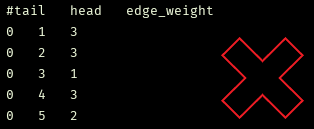

# NetRender
> Script to render interactive brain networks in three-dimensional space

I wrote this script in Spring 2018 while taking [CS 4984: Computing The Brain](http://courses.cs.vt.edu/cs4984/2018-spring-computing-the-brain/) Capstone, taught by [T.M. Murali](http://bioinformatics.cs.vt.edu/~murali/), at Virginia Tech. Many of the assignments involved analysis of large-scale brain networks, which proved to be difficult without a visual point of reference. Dr. Murali mentioned that the visualization of a network in the shape of the brain would make a great addition to my semester project, but all of the open-source tools I tried (such as [cvu](https://github.com/aestrivex/cvu) and [flexbgv](https://sourceforge.net/projects/flexbgv/)) required huge dependencies and custom file formats without much documentation.
This project allows users to render interactive 3D networks in their browser using Python without the need for excessive dependencies. My goal is that future CS 4984 can use this program to help understand their assignments and make cool images for presentations.


## Table of Contents
  * [Installation](#installation)
  * [Usage](#usage)
    - [Input Format](#input-format)
    - [Command-Line Options](#command-line-options)
    - [Examples](#examples)
  * [Implementation](#implementation)


## Installation
To install, simply clone this repository using the following command: 
```commandline
git clone https://github.com/tsevans/NetRender.git
```

<br>

If you do not already have Python on your computer, you'll want to download the latest version [here](https://www.python.org/downloads/). I'm using version 3.6.5.

<br>

The first dependency needed to run this script is [Plot.ly](https://plot.ly/), a free and open-source visualization library packaged into a Python module.
This script generates temporary visualizations in your local environment, but with a few modifications you can save ~25 visualizations by signing up for a [free Plot.ly account](https://plot.ly/accounts/login/#/).

Install the plot.ly module with the following command:
```commandline
pip install plotly
```
<br>

The second dependency needed to run this script is [python-igraph](http://igraph.org/python/), a free and open-source collection of network analysis tools implemented as a C library with Python extensions.
As with many other Python packages it may be tempting to use `pip install`; however, this method did not prove to be effective on any of the systems I tried.
Luckily for you, I've already been down the rabbit hole of Stack Overflow posts on the issue and found solutions to install python-igraph on both Linux and Windows.

If you're running Linux the installation is simple, just run the following commands:
```commandline
sudo apt-get update
sudo apt-get install python-igraph
```
This worked when tested on both KDE and Ubuntu using the apt package manager.
If you use another package manager or run any special configurations, the commands may need to be modified accordingly.

If you're running Windows there will be some additional steps in order to support C.
* Download the Microsoft Visual C++ Build Tools from [here](https://www.visualstudio.com/downloads/#build-tools-for-visual-studio-2017)
* Do


## Usage

This program takes a single file as input and can be run using the command:
```commandline
python netrender.py <input.txt>
```
where `<input.txt>` is the name or relative path to the file you wish to visualize.

### *Input Format*
The input for the program is a standard edge list file following the usual format [`src_node` `dst_node` `weight`] on each line of the file. The program can accept as input a .txt file, with either tab-delimited or space-delimited values, or a .csv file following the aforementioned format.

One important thing to note is that the program does not currently account for column headers in input files. Shown below are examples of incorrect and correct input files with headers and without headers, respectively:

*Incorrect:*                                                    |  *Correct:*
:--------------------------------------------------------------:|:--------------------------------------------------------------:
  |  

If your input file has column headers, you'll want to delete them to avoid extraneous vertices in the network.

### *Command-Line Options*


### *Examples*
There are three example networks you can use to test this program.

* **cat_connectome.txt**
    * [_The Small World of the Cerebral Cortex_](https://www.ncbi.nlm.nih.gov/pubmed/15319512)
* **macaque_connectome.txt**
    * [_The Small World of the Cerebral Cortex_](https://www.ncbi.nlm.nih.gov/pubmed/15319512)
* **mouse_connectome.txt**
    * [_Organizing principles for the cerebral cortex network of commissural and association connections_](http://www.pnas.org/content/pnas/114/45/E9692.full.pdf)
    

## Implementation
This section describes the structure of the NetRender program and various design decisions made during implementation.

The [python-igraph](http://igraph.org/python/) library is neede d for it's unique 3D variation of the [Kamada-Kawai](http://citeseerx.ist.psu.edu/viewdoc/download?doi=10.1.1.387.7401&rep=rep1&type=pdf) force-directed layout algorithm for undirected graphs.
The algorithm maps each vertex to a tuple of (x,y,z) coordinates, which is piped plot.ly's [3D Scatter Plot layout](https://plot.ly/python/3d-scatter-plots/). 
 