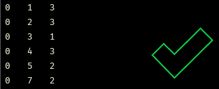

# NetRender
> Script to render interactive brain networks in three-dimensional space

I wrote this script in Spring 2018 while taking [CS 4984: Computing The Brain](http://courses.cs.vt.edu/cs4984/2018-spring-computing-the-brain/) Capstone, taught by [T.M. Murali](http://bioinformatics.cs.vt.edu/~murali/), at Virginia Tech. Many of the assignments involved analysis of large-scale brain networks, which proved to be difficult without a visual point of reference. Dr. Murali mentioned that the visualization of a network in the shape of the brain would make a great addition to my semester project, but all of the open-source tools I tried (such as [cvu](https://github.com/aestrivex/cvu) and [flexbgv](https://sourceforge.net/projects/flexbgv/)) required huge dependencies and custom file formats without much documentation.
This project allows users to render interactive 3D networks in their browser using Python without the need for excessive dependencies. My goal is that future CS 4984 can use this program to help understand their assignments and make cool images for presentations.

<br>

## Table of Contents
  * [Installation](#installation)
  * [Usage](#usage)
    - [Input Format](#input-format)
    - [Command-Line Options](#command-line-options)
    - [Examples](#examples)

<br>

## Installation
To install, simply clone this repository using the following command: 
```
git clone https://github.com/tsevans/NetRender.git
```
If you do not already have Python on your computer, you'll want to download the latest version [here](https://www.python.org/downloads/). I'm using version 3.6.5.

The main dependency needed to run this script is [Plot.ly](https://plot.ly/), a free and open-source visualization library packaged into a Python module. This script generates temporary visualizations in your local environment, but with a few modifications you can save ~25 visualizations by signing up for a [free Plot.ly account](https://plot.ly/accounts/login/#/). This may be helpful if you plan to use Plot.ly again in the future, but isn't necessary because generated networks can be exported as PNGs from the browser.

<br>

## Usage

### Input Format
The input for the program is a standard edge list file following the usual format [`src_node` `dst_node` `weight`] on each line of the file. The program can accept as input a .txt file, with either tab-delimited or space-delimited values, or a .csv file following the aforementioned format.

One important thing to note is that the program does not currently account for column headers in input files. Shown below are examples of incorrect and correct input files with headers and without headers, respectively:

*Incorrect:*                                                    |  *Correct:*
:--------------------------------------------------------------:|:--------------------------------------------------------------:
  |  

If your input file has column headers, you'll want to delete them to avoid extraneous vertices in the network.

<br>

### Command-Line Options


<br>

### Examples
There are three example networks you can use to test this program.

* **cat_connectome.txt**
    * [_The Small World of the Cerebral Cortex_](https://www.ncbi.nlm.nih.gov/pubmed/15319512)
    
* **macaque_connectome.txt**
    * [_The Small World of the Cerebral Cortex_](https://www.ncbi.nlm.nih.gov/pubmed/15319512)
    
* **mouse_connectome.txt**
    * [_Organizing principles for the cerebral cortex network of commissural and association connections_](http://www.pnas.org/content/pnas/114/45/E9692.full.pdf)